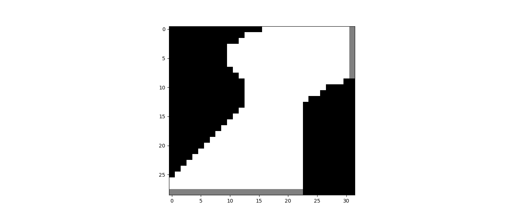
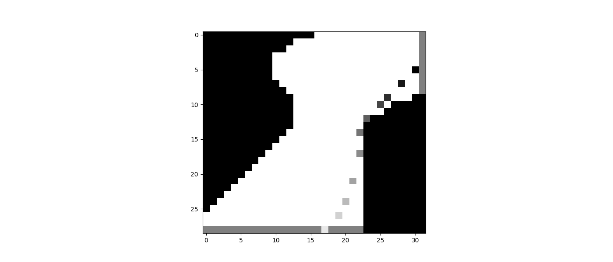
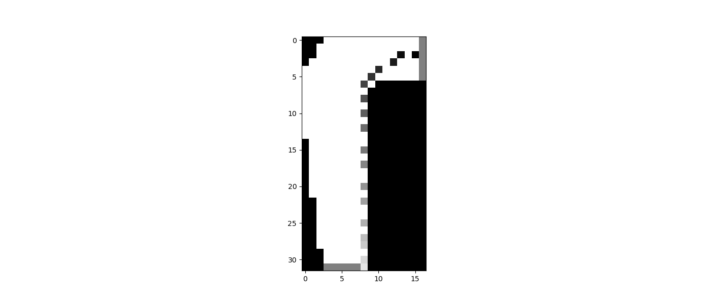

In this programming exercise we face the problem of a racetrack where
the goal is to finish the race as fast as possible. We do it by implementing
an on policy monte carlo control algorithm which takes averages of 
the returns of simulated episodes which we create using an epsilon soft
policy.
The tracks used are given in the book:

First Track             |  Second Track
:-------------------------:|:-------------------------:
  |  

As we go on and increase the number of episodes which will be 
generated then our algorithm will converge to a better policy.
An example of the paths that our policy takes in both racetracks:

First Track             |  Second Track
:-------------------------:|:-------------------------:
  |  
